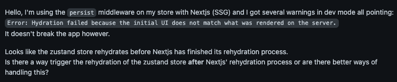
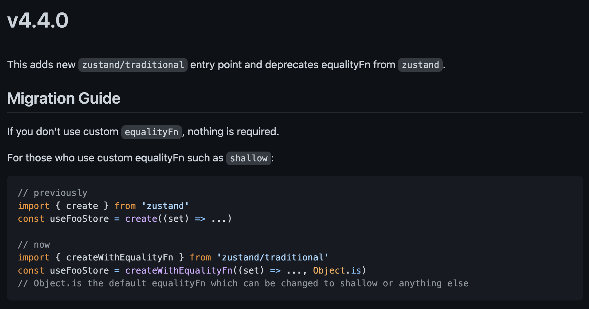
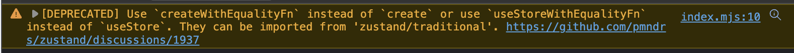

# Zustand + Persist(localstorage) + Next.js

## Zustand 의 persist 기능 사용시 hydration 이슈에 대응하기 위한 코드를 작성함

- 이미지

  - 

- 이슈 링크
  https://github.com/pmndrs/zustand/issues/938

- 해결방안

  - 참고 url
    https://github.com/pmndrs/zustand/issues/1145#issuecomment-1209244183

  - useEffect 를 이용하여 hydrate 가 되었는지 감지하는 상태를 넣어두고 hydrate 가 되었다면 persist 를 사용한 store 를 반환하고 그렇지 않았다면 persist 가 없는 init state(초기 상태값) 을 반환하게 하여 해결

  - code

    ```typescript
    const emptyState = {
      where: {
        places: [],
      },
      what: {
        filters: {},
      },
      setPlaces: () => {
        return;
      },
      setFilters: () => {
        return;
      },
    };

    const usePersistedStore = create(
      persist<State>(
        (set) => ({
          where: {
            places: [],
          },
          what: {
            filters: {},
          },
          setPlaces: (newPlaces) =>
            set({
              where: {
                places: newPlaces,
              },
            }),
          setFilters: (filters) =>
            set({
              what: {
                filters,
              },
            }),
        }),
        {
          name: 'search-storage',
        },
      ),
    );

    // This a fix to ensure zustand never hydrates the store before React hydrates the page
    // else it causes a mismatch between SSR/SSG and client side on first draw which produces an error
    export const useStore = ((selector, compare) => {
      const store = usePersistedStore(selector, compare);
      const [hydrated, setHydrated] = useState(false);
      useEffect(() => setHydrated(true), []);

      return hydrated ? store : selector(emptyState);
    }) as typeof usePersistedStore;
    ```

## Zustand 의 create 함수 deprecated 에 관해

- 이번 v4.4.0 버전에서 create 함수 -> createWithEqualityFn 함수로 사용하도록 권고함(v4.4.0 이상버전부터는 create 함수 사용시 deprecated 로 warning 이 출력됨)
- 아래 이미지 처럼 create 가 deprecated 되었으니 createWithEqualityFn 을 사용해라고 경고하고 있다.
- 기존에는(v4.4.0 이전) create 를 사용하여 store 를 생성하여 각 컴포넌트에서 store 를 사용시에 불필요한 리렌더링을 방지하기 위해 shallow 를 매번 넣어 주어야 했다.
- 이제 createWithEqualityFn 을 사용하면서 shallow 를 미리 세팅할 수 있어, 사용하는 컴포넌트에서는 shallow 를 넣어줄 필요가 없어진다.

- 이미지

  
  

- 이슈 링크
  https://github.com/pmndrs/zustand/discussions/1937

- 해결방안

  - 기존 zustand 에서 create 를 import 해서 사용하던것을 'zustand/traditional'에서 'createWithEqualityFn' 를 import 해와서 create 를 대체해야한다.

  - code

    ```typescript
    import { shallow } from 'zustand/shallow';
    - import { create } from 'zustand'
    + import { createWithEqualityFn } from 'zustand/traditional'

    - const useMyStore = create(...)
    + const useMyStore = createWithEqualityFn(..., shallow)
    ```
