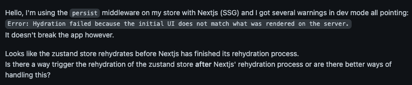
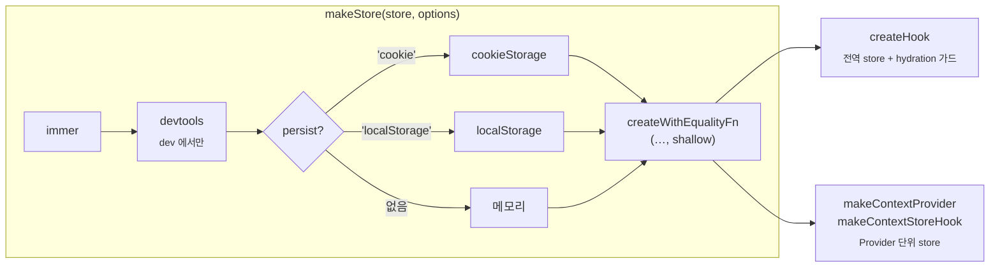
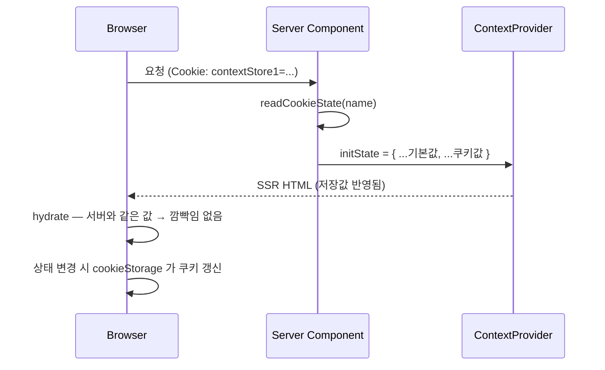

# Zustand + Persist + Next.js (App Router)

Zustand 를 Next.js 에서 쓸 때 반복되는 보일러플레이트와 **persist hydration 문제**를 해결하기 위한 실험 프로젝트.
핵심은 [`src/utils/zustand`](./src/utils/zustand) 의 유틸이다.

> zustand 5.0.14 · Next.js 16.3.8 · React 19.1 기준

## 해결하려는 문제

| 문제 | 해결 |
|---|---|
| store 마다 `create` + `persist` + `devtools` + `immer` 를 반복해서 감쌈 | `makeStore` 한 줄로 통합 |
| 컴포넌트마다 `shallow` 를 넘겨야 불필요한 리렌더링이 없음 | `createWithEqualityFn(..., shallow)` 로 기본값 지정 |
| persist(localStorage) 값이 SSR 결과와 달라 **hydration mismatch** 발생 ([#938](https://github.com/pmndrs/zustand/issues/938)) | `createHook` 이 hydration 전에는 초기값 반환 |
| 그래도 첫 화면에 초기값 → 저장값으로 **깜빡임** | 쿠키 persist + 서버에서 쿠키를 읽어 초기값 주입 |
| `(s) => ({ a: s.a, b: s.b })` selector 반복 작성 | `selector(['a', 'b', 'car.spec.inch'])` |



## 구조


```mermaid
flowchart LR
  subgraph makeStore["makeStore(store, options)"]
    direction LR
    I[immer] --> D[devtools<br/><sub>dev 에서만</sub>] --> P{persist?}
    P -- "'cookie'" --> C[cookieStorage]
    P -- "'localStorage'" --> L[localStorage]
    P -- 없음 --> M[메모리]
    C & L & M --> E["createWithEqualityFn<br/>(…, shallow)"]
  end

  E --> H1["createHook<br/><sub>전역 store + hydration 가드</sub>"]
  E --> H2["makeContextProvider<br/>makeContextStoreHook<br/><sub>Provider 단위 store</sub>"]
```

```
src/utils/zustand
├── types.ts                  # TSelector, TCompare, TCreateStore
├── zustandUtils              # 전역 store
│   ├── makeStore.ts          # store 생성 통합 진입점
│   ├── hooks.ts              # createHook (hydration 가드)
│   ├── selector.ts           # 배열/dot 경로 selector
│   ├── cookieStorage.ts      # 쿠키 기반 StateStorage
│   └── readCookieState.ts    # 서버에서 persist 쿠키 읽기 (next/headers)
└── zustandContextUtils       # Context(Provider) 기반 store
    ├── provider.tsx          # makeContextProvider
    └── hook.ts               # makeContextStoreHook
```

## 사용법

### 1. 전역 store — `makeStore` + `createHook`

```ts
// stores/fooStore.ts
import { createHook, makeStore } from '@/utils/zustand/zustandUtils';

export const initState = { count: 0, isOn: false };

export const createStore = makeStore<TStore>(
  (set) => ({
    ...initState,
    setInc: () => set((state) => { state.count += 1; }), // immer
  }),
  { persist: 'localStorage', name: 'fooStore' }, // 생략 시 메모리 전용
);

export const useFooStore = createHook<TStore>(createStore, initState);
```

```tsx
// 컴포넌트
const { count, setInc, carSpecInch } = useFooStore(
  selector(['count', 'setInc', 'car.spec.inch']), // dot 경로 → camelCase 키, 타입 추론됨
  (a, b) => a.count === b.count,                   // 선택. 기본값 shallow
);
```

`createHook` 은 [`useHydrated`](./src/hooks/useHydrated.ts) (`useSyncExternalStore` 기반)로 hydration 전에는 `initState` 를, 이후에는 실제 store 값을 반환한다. mismatch 에러는 없지만 **저장값으로 바뀌는 순간 깜빡임**은 남는다.

### 2. Provider 단위 store — 쿠키 persist + SSR 주입 (깜빡임 없음)


```mermaid
sequenceDiagram
  participant B as Browser
  participant S as Server Component
  participant P as ContextProvider
  B->>S: 요청 (Cookie: contextStore1=...)
  S->>S: readCookieState(name)
  S->>P: initState = { ...기본값, ...쿠키값 }
  P-->>B: SSR HTML (저장값 반영됨)
  B->>B: hydrate — 서버와 같은 값 → 깜빡임 없음
  B->>B: 상태 변경 시 cookieStorage 가 쿠키 갱신
```

```tsx
// stores/contextStore.tsx ('use client')
export const createStore = (initState?: Partial<TStore>, name = 'contextStore') =>
  makeStore<TStore>((set) => ({ ...defaultState, ...initState, /* actions */ }), {
    persist: 'cookie',
    name,
  });

export const { ContextProvider, context } = makeContextProvider<TStore>(createStore);
export const useContextStore = makeContextStoreHook(context); // useShallow 적용
```

```tsx
// Server Component
import { readCookieState } from '@/utils/zustand/zustandUtils/readCookieState'; // 서버 전용, barrel 미포함

const cookieState = await readCookieState<TStore>(name);

<ContextProvider name={name} initState={{ ...initState, ...cookieState }}>
  <Count />
</ContextProvider>
```

`name` 이 persist 키이자 쿠키 키라서 Provider 인스턴스마다 고유해야 한다.

## persist 방식 선택

| | `localStorage` | `cookie` |
|---|---|---|
| 서버에서 읽기 | ❌ | ✅ (`readCookieState`) |
| 첫 렌더 깜빡임 | 있음 | 없음 |
| 용량 / 오버헤드 | 크게 저장 가능, 요청에 안 실림 | 약 4KB, **매 요청에 실림** |
| 적합한 상태 | 큰 데이터, 클라 전용 화면 | 테마·토글 같은 작은 UI 상태 |

## 실험 페이지

`pnpm dev` 후 `/` 접속 시 `/foo-ground` 로 이동.

| 경로 | 내용 |
|---|---|
| `/foo-ground` | `makeStore` + localStorage + `createHook` + 커스텀 compare |
| `/bar-ground` | 중첩 경로 `selector(['car.spec.inch'])` |
| `/context-ground` | Provider 2개 독립 store + 쿠키 persist + SSR 주입 |
| `/vee-ground` | 유틸 없이 `createWithEqualityFn` 직접 사용 (비교용) |

## 참고

- `zustand/traditional` 은 `use-sync-external-store` 를 peer 로 요구하므로 직접 의존성으로 설치되어 있다 ([공식 문서](https://zustand.docs.pmnd.rs/reference/apis/create-with-equality-fn)).
- hydration 이슈: [pmndrs/zustand#938](https://github.com/pmndrs/zustand/issues/938), [해결 아이디어](https://github.com/pmndrs/zustand/issues/1145#issuecomment-1209244183)
